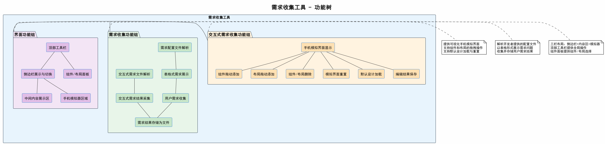

# 需求收集工具 - 功能树

## 1. 概述

本文档描述需求收集工具的完整功能分解。系统由三大功能组构成，每个功能组包含若干具体功能点。

## 2. 功能树

## 3. 功能组说明

### 3.1 交互式需求收集功能组

提供可视化手机模拟界面，允许用户通过拖拽方式组合组件和布局，实现交互式需求表达。

| 编号 | 功能名称 | 功能描述 |
|------|----------|----------|
| F1-1 | 手机模拟界面显示 | 在右侧区域渲染一个模拟手机屏幕，展示当前布局效果 |
| F1-2 | 组件拖动添加 | 从组件面板拖动UI组件（按钮、文本框、图片等）到模拟界面 |
| F1-3 | 布局拖动添加 | 从组件面板拖动布局容器（横向、纵向、网格等）到模拟界面 |
| F1-4 | 组件/布局删除 | 在模拟界面中选中已添加的组件或布局，执行删除操作 |
| F1-5 | 模拟界面重置 | 清空模拟界面中所有已添加的组件和布局，恢复初始状态 |
| F1-6 | 默认设计加载 | 加载开发者提供的默认设计方案，作为初始展示内容 |
| F1-7 | 编辑结果保存 | 将用户在模拟界面中完成的编辑结果保存为结构化数据 |

### 3.2 需求收集功能组

负责解析开发者编写的配置文件，以表格形式展示需求问题，并收集用户的回答。

| 编号 | 功能名称 | 功能描述 |
|------|----------|----------|
| F2-1 | 需求配置文件解析 | 解析开发者编写的需求配置文件，提取问题、选项等信息 |
| F2-2 | 交互式需求文件解析 | 解析开发者编写的交互式需求收集配置文件（组件和布局定义） |
| F2-3 | 表格式需求展示 | 以表格形式在中间内容区展示需求问题、目的、选项、备注等 |
| F2-4 | 用户需求收集 | 收集用户通过文字输入或选项选择方式提交的需求回答 |
| F2-5 | 交互式需求结果采集 | 调用交互式需求收集界面，将用户编辑结果采集为需求回答 |
| F2-6 | 需求结果存储为文件 | 将所有收集到的用户需求整理并保存为结构化输出文件 |

### 3.3 界面功能组

提供系统的整体界面框架和布局，包括侧边栏、内容区、模拟器和工具栏。

| 编号 | 功能名称 | 功能描述 |
|------|----------|----------|
| F3-1 | 侧边栏展示与切换 | 左侧侧边栏，展示需求分类列表，支持不同需求方面的切换 |
| F3-2 | 中间内容展示区 | 中央主内容区，展示表格式需求问题列表和用户填写界面 |
| F3-3 | 手机模拟器区域 | 右侧手机模拟器区域，嵌入交互式需求收集的模拟手机界面 |
| F3-4 | 顶部工具栏 | 顶部工具栏，包含应用标题、菜单项、全局操作按钮 |
| F3-5 | 组件/布局面板 | 通过工具栏呼出的组件面板，展示开发者准备的组件和布局列表，支持拖拽 |

## 4. 功能组之间的关系

- **界面功能组** 为其他两个功能组提供界面容器和布局支持
- **需求收集功能组** 在表格式需求展示中调用 **交互式需求收集功能组** 的模拟界面
- **交互式需求收集功能组** 的编辑结果回传给 **需求收集功能组** 进行存储
