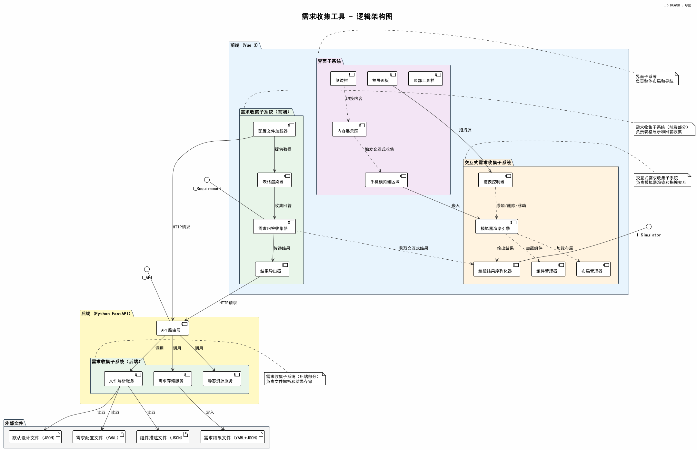

# 需求收集工具 - 逻辑架构图

## 1. 概述

系统采用前后端分离架构，前端基于 Vue 3，后端基于 Python FastAPI，遵循 MVC 模式。逻辑上分为三个子系统：界面子系统、交互式需求收集子系统、需求收集子系统。

## 2. 逻辑架构图

## 3. 子系统划分

### 3.1 界面子系统（前端）

负责系统整体界面布局和导航控制。

| 模块 | 职责 |
|------|------|
| 顶部工具栏 | 应用标题、菜单、全局操作（呼出抽屉、重置等） |
| 侧边栏 | 展示需求分类列表，切换不同需求方面 |
| 内容展示区 | 中央主区域，承载表格渲染和需求填写 |
| 手机模拟器区域 | 右侧区域，嵌入交互式模拟器 |
| 抽屉面板 | 通过工具栏呼出，展示组件和布局列表，支持拖拽 |

### 3.2 交互式需求收集子系统（前端）

负责手机模拟界面的渲染和拖拽交互操作。

| 模块 | 职责 |
|------|------|
| 模拟器渲染引擎 | 在模拟器区域动态加载并渲染开发者提供的组件 |
| 拖拽控制器 | 管理从抽屉面板到模拟器的拖拽操作（添加、移动、删除） |
| 组件管理器 | 加载和管理开发者提供的组件描述文件，维护组件注册表 |
| 布局管理器 | 加载和管理开发者提供的布局定义，维护布局注册表 |
| 编辑结果序列化器 | 将模拟器中的编辑状态序列化为结构化JSON数据 |

### 3.3 需求收集子系统（前端 + 后端）

负责配置文件解析、表格展示、回答收集和结果存储。

**前端部分：**

| 模块 | 职责 |
|------|------|
| 配置文件加载器 | 通过API获取后端解析后的配置数据 |
| 表格渲染器 | 将配置数据渲染为可交互的表格界面 |
| 需求回答收集器 | 收集用户在表格中的回答（文字/选项/交互式结果） |
| 结果导出器 | 将收集到的需求通过API提交给后端存储 |

**后端部分：**

| 模块 | 职责 |
|------|------|
| 文件解析服务 | 解析开发者提供的YAML配置文件和JSON组件描述文件 |
| 需求存储服务 | 将用户需求结果写入YAML+JSON文件 |
| 静态资源服务 | 提供开发者组件库的静态资源访问 |

## 4. 子系统间交互关系

| 调用方 | 被调用方 | 交互方式 | 说明 |
|--------|----------|----------|------|
| 界面子系统 | 交互式需求收集子系统 | 前端组件嵌入 | 模拟器区域嵌入渲染引擎 |
| 界面子系统 | 需求收集子系统 | 前端组件嵌入 | 内容展示区承载表格渲染 |
| 需求收集子系统（前端） | 交互式需求收集子系统 | 前端内部调用 | 表格中触发交互式收集，获取序列化结果 |
| 需求收集子系统（前端） | 需求收集子系统（后端） | HTTP API | 请求配置数据，提交需求结果 |
| 需求收集子系统（后端） | 外部文件 | 文件读写 | 读取开发者配置，写入用户结果 |

## 5. 外部接口

| 接口标识 | 提供方 | 消费方 | 说明 |
|----------|--------|--------|------|
| I_Simulator | 交互式需求收集子系统 | 需求收集子系统 | 提供模拟器的打开/关闭、结果获取能力 |
| I_Requirement | 需求收集子系统（前端） | 界面子系统 | 提供需求数据的加载、展示、收集能力 |
| I_API | 需求收集子系统（后端） | 需求收集子系统（前端） | 提供文件解析、结果存储的HTTP接口 |
