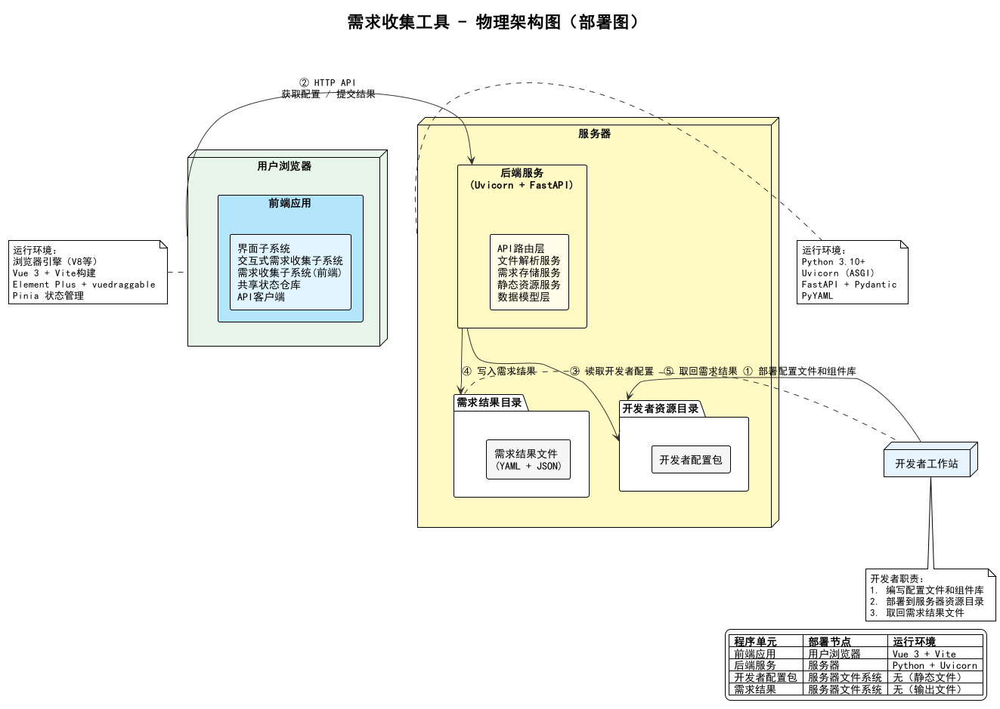

# 需求收集工具 - 物理架构图（部署图）

## 1. 概述

物理架构图展示程序单元到物理节点的部署映射，以及各节点所需的运行环境。以程序单元图为依据，描述哪些程序单元部署到哪些机器上，依靠什么环境运行。

## 2. 物理架构图



## 3. 部署映射

| 程序单元 | 部署节点 | 运行环境 |
|----------|----------|----------|
| 前端应用 | 用户浏览器 | 浏览器引擎（V8等），Vue 3 + Vite 构建，Element Plus + vuedraggable + Pinia |
| 后端服务 | 服务器 | Python 3.10+，Uvicorn (ASGI)，FastAPI + Pydantic + PyYAML |
| 开发者配置包 | 服务器文件系统 | 无需运行环境（静态文件） |
| 需求结果文件 | 服务器文件系统 | 无需运行环境（输出文件） |

## 4. 物理节点说明

### 4.1 用户浏览器

部署**前端应用**程序单元。包含界面子系统、交互式需求收集子系统、需求收集子系统（前端）等全部前端模块。

运行环境依赖：
- 浏览器引擎（Chrome V8 / Firefox SpiderMonkey 等）
- 前端通过 Vite 构建打包为静态资源（HTML/JS/CSS），由浏览器直接加载运行

### 4.2 服务器

部署**后端服务**和**开发者配置包**。

**后端服务**：包含API路由层、文件解析服务、需求存储服务、静态资源服务、数据模型层。

运行环境依赖：
- Python 3.10+
- Uvicorn（ASGI 服务器）
- FastAPI（Web 框架）
- Pydantic（数据校验）
- PyYAML（YAML 文件解析）

**服务器目录结构：**
```
服务器根目录/
├── backend/                  # 后端服务
│   ├── main.py
│   ├── routers/
│   ├── services/
│   └── models/
├── dev-config/               # 开发者配置包（由开发者部署）
│   ├── requirements.yaml
│   ├── components.json
│   ├── default_layout.json
│   └── lib/
└── output/                   # 需求结果目录（由系统写入）
    ├── result.yaml
    └── result.json
```

### 4.3 开发者工作站

不部署任何程序单元。开发者在此准备配置文件和组件库，然后部署到服务器资源目录；用户完成需求填写后，开发者从服务器取回结果文件。

## 5. 数据流（部署视角）

| 步骤 | 操作 | 涉及节点 |
|------|------|----------|
| ① | 开发者将配置文件和组件库部署到服务器资源目录 | 开发者工作站 → 服务器 |
| ② | 用户浏览器通过 HTTP API 获取配置数据、提交需求结果 | 用户浏览器 → 服务器 |
| ③ | 后端服务读取开发者配置包中的文件 | 服务器内部 |
| ④ | 后端服务将需求结果写入输出目录 | 服务器内部 |
| ⑤ | 开发者从服务器取回需求结果文件 | 开发者工作站 ← 服务器 |
