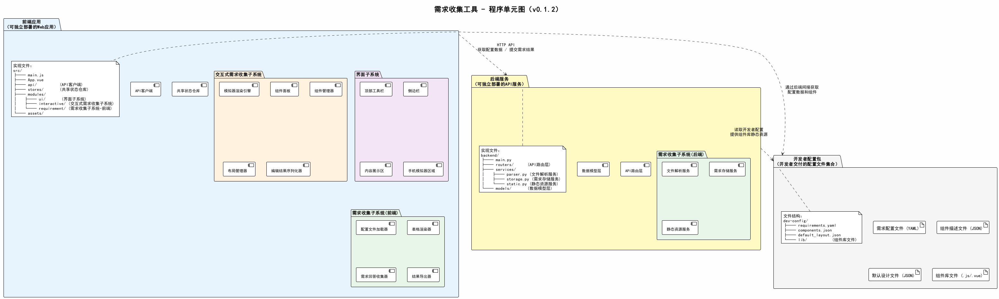

# 需求收集工具 - 程序单元图

## 1. 概述

程序单元是系统中可以独立交付和部署的单元。每个程序单元由逻辑架构图中的子系统/模块组成，由具体的文件实现。程序单元图沟通了逻辑架构、物理架构和项目结构。

## 2. 程序单元图



## 3. 程序单元清单

### 3.1 前端应用

可独立部署的Web应用，由 Vite 构建打包为静态资源。

**包含的逻辑模块：**

| 子系统 | 包含模块 |
|--------|----------|
| 界面子系统 | 顶部工具栏、侧边栏、内容展示区、手机模拟器区域 |
| 交互式需求收集子系统 | 模拟器渲染引擎、组件面板、组件管理器、布局管理器、编辑结果序列化器 |
| 需求收集子系统（前端） | 配置文件加载器、表格渲染器、需求回答收集器、结果导出器 |
| 横切模块 | 共享状态仓库、API客户端 |

**实现文件结构：**
```
src/
├── main.js                          # 应用入口
├── App.vue                          # 根组件
├── api/                             # API客户端
├── stores/                          # 共享状态仓库（Pinia）
├── modules/
│   ├── ui/                          # 界面子系统
│   ├── interactive/                 # 交互式需求收集子系统
│   └── requirement/                 # 需求收集子系统（前端）
└── assets/                          # 静态资源
```

### 3.2 后端服务

可独立部署的API服务，运行在 Uvicorn (ASGI) 上。

**包含的逻辑模块：**

| 子系统 | 包含模块 |
|--------|----------|
| 需求收集子系统（后端） | 文件解析服务、需求存储服务、静态资源服务 |
| 横切模块 | API路由层、数据模型层 |

**实现文件结构：**
```
backend/
├── main.py                          # 应用入口
├── routers/                         # API路由层
├── services/
│   ├── parser.py                    # 文件解析服务
│   ├── storage.py                   # 需求存储服务
│   └── static.py                    # 静态资源服务
└── models/                          # 数据模型层（Pydantic）
```

### 3.3 开发者配置包

开发者准备并交付的配置文件集合，部署到服务器指定目录。

**包含内容：**

| 文件 | 格式 | 用途 |
|------|------|------|
| requirements.yaml | YAML | 需求问题、目的、选项、备注定义 |
| components.json | JSON | 组件名称、属性、默认值描述 |
| default_layout.json | JSON | 模拟器默认布局方案 |
| lib/ | .vue | 开发者组件库文件（标准 Vue SFC 格式，每个组件一个目录） |

**文件结构：**
```
dev-config/
├── requirements.yaml
├── components.json
├── default_layout.json
└── lib/                             # 组件库文件（每个组件一个目录）
```

## 4. 程序单元间关联

| 关联 | 说明 | 方式 |
|------|------|------|
| 前端应用 ↔ 后端服务 | 获取配置数据、提交需求结果 | HTTP API |
| 后端服务 ↔ 开发者配置包 | 读取开发者配置、提供组件库静态资源 | 文件系统 |
| 前端应用 ↔ 开发者配置包 | 通过后端间接获取配置和组件 | 间接（经后端中转） |

## 5. 程序单元与逻辑架构的映射

| 程序单元 | 界面子系统 | 交互式需求收集子系统 | 需求收集子系统(前端) | 需求收集子系统(后端) |
|----------|:----------:|:--------------------:|:--------------------:|:--------------------:|
| 前端应用 | ✓ | ✓ | ✓ | |
| 后端服务 | | | | ✓ |
| 开发者配置包 | | | | |
