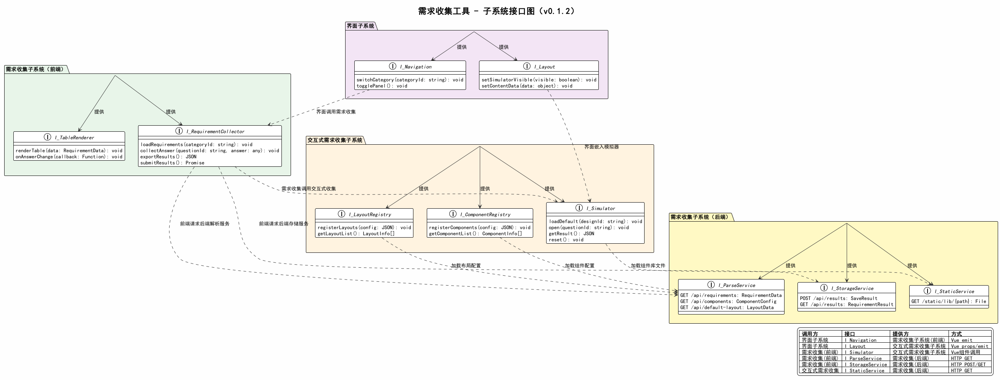

# 需求收集工具 - 子系统接口文档

## 1. 概述

本文档规定三大子系统之间的接口定义，包括接口名称、提供方、调用方、调用方式和接口方法签名。

## 2. 子系统接口图



## 3. 接口总览

| 接口标识 | 接口名称 | 提供方 | 调用方 | 调用方式 |
|----------|----------|--------|--------|----------|
| I_Navigation | 导航接口 | 界面子系统 | 需求收集子系统(前端) | Vue emit |
| I_Layout | 布局接口 | 界面子系统 | 交互式需求收集子系统 | Vue props/emit |
| I_Simulator | 模拟器接口 | 交互式需求收集子系统 | 需求收集子系统(前端) | Vue组件调用 |
| I_ComponentRegistry | 组件注册接口 | 交互式需求收集子系统 | 需求收集子系统(后端) | 间接(HTTP→前端加载) |
| I_LayoutRegistry | 布局注册接口 | 交互式需求收集子系统 | 需求收集子系统(后端) | 间接(HTTP→前端加载) |
| I_ParseService | 文件解析接口 | 需求收集子系统(后端) | 需求收集子系统(前端) | HTTP GET |
| I_StorageService | 需求存储接口 | 需求收集子系统(后端) | 需求收集子系统(前端) | HTTP POST/GET |
| I_StaticService | 静态资源接口 | 需求收集子系统(后端) | 交互式需求收集子系统 | HTTP GET |

## 4. 前端内部接口详细定义

### 4.1 I_Navigation（导航接口）

提供方：界面子系统 | 调用方：需求收集子系统(前端)

| 方法 | 参数 | 返回值 | 说明 |
|------|------|--------|------|
| switchCategory | categoryId: string | void | 切换侧边栏中的需求分类，触发内容区刷新 |
| togglePanel | - | void | 打开/关闭组件面板（通过共享状态仓库，组件面板属于交互式需求收集子系统） |

### 4.2 I_Layout（布局接口）

提供方：界面子系统 | 调用方：交互式需求收集子系统

| 方法 | 参数 | 返回值 | 说明 |
|------|------|--------|------|
| toggleSimulator | - | void | 切换手机模拟器区域的显示/隐藏 |

### 4.3 I_Simulator（模拟器接口）

提供方：交互式需求收集子系统 | 调用方：需求收集子系统(前端)

| 方法 | 参数 | 返回值 | 说明 |
|------|------|--------|------|
| loadDefault | layoutId: string | void | 加载指定默认布局方案到模拟器 |
| openForQuestion | questionId: string, defaultLayoutId?: string | void | 打开模拟器关联指定需求问题，可选加载默认布局 |
| getResult | - | { nodes: LayoutNode[] } | 获取当前模拟器的编辑结果 |
| reset | - | void | 重置模拟器为初始状态 |

### 4.4 I_ComponentRegistry（组件注册接口）

提供方：交互式需求收集子系统 | 调用方：系统初始化时通过后端加载

| 方法 | 参数 | 返回值 | 说明 |
|------|------|--------|------|
| loadComponents | - | Promise\<void\> | 从后端加载组件描述，按 isContainer 分为组件列表和布局列表 |
| componentList | - | ComponentInfo[] | 非容器组件列表 |
| layoutList | - | ComponentInfo[] | 容器组件列表 |

### 4.5 I_LayoutRegistry（布局注册接口）

提供方：交互式需求收集子系统 | 调用方：系统初始化时通过后端加载

| 方法 | 参数 | 返回值 | 说明 |
|------|------|--------|------|
| loadDefaultLayouts | - | Promise\<void\> | 从后端加载默认布局方案列表 |
| defaultLayouts | - | LayoutScheme[] | 默认布局方案列表 |

### 4.6 I_RequirementCollector（需求收集接口）

提供方：需求收集子系统(前端) | 调用方：界面子系统

| 方法 | 参数 | 返回值 | 说明 |
|------|------|--------|------|
| loadRequirements | - | Promise\<void\> | 加载需求问题数据，自动设置首个分类 |
| setAnswer | questionId: string, answer: any | void | 收集单个问题的用户回答 |
| getAnswer | questionId: string | Answer \| null | 获取指定问题的已有回答 |
| submitResults | - | Promise\<void\> | 将需求结果提交到后端存储 |

## 5. 后端HTTP接口详细定义

### 5.1 I_ParseService（文件解析接口）

提供方：需求收集子系统(后端) | 调用方：需求收集子系统(前端)

| HTTP方法 | 路径 | 参数 | 返回值 | 说明 |
|----------|------|------|--------|------|
| GET | /api/requirements | categoryId?: string | RequirementData | 获取需求配置数据 |
| GET | /api/components | - | ComponentConfig | 获取组件描述配置 |
| GET | /api/default-layout | - | LayoutData | 获取默认设计方案 |

### 5.2 I_StorageService（需求存储接口）

提供方：需求收集子系统(后端) | 调用方：需求收集子系统(前端)

| HTTP方法 | 路径 | 参数 | 返回值 | 说明 |
|----------|------|------|--------|------|
| POST | /api/results | body: RequirementResult | { success: boolean } | 保存用户需求结果 |
| GET | /api/results | - | RequirementResult | 获取已保存的需求结果 |

### 5.3 I_StaticService（静态资源接口）

提供方：需求收集子系统(后端) | 调用方：交互式需求收集子系统(前端)

| HTTP方法 | 路径 | 参数 | 返回值 | 说明 |
|----------|------|------|--------|------|
| GET | /static/lib/{path} | path: string | File | 获取开发者组件库文件 |

## 6. 数据类型定义

### RequirementData
```
{
  project: ProjectInfo              // 项目信息
  categories: Category[]            // 需求分类列表
}
ProjectInfo {
  id: string                        // 项目ID
  name: string                      // 项目名称
  description?: string              // 项目描述
}
Category {
  id: string                        // 分类ID
  name: string                      // 分类名称
  order: number                     // 排序序号
  questions: Question[]             // 问题列表
}
Question {
  id: string                        // 问题ID
  text: string                      // 问题内容
  purpose: string                   // 问题目的
  type: "text" | "option" | "interactive"  // 回答类型
  options?: string[]                // 选项列表（type=option时）
  allowCustom?: boolean             // 是否允许自定义输入
  interactiveConfig?: InteractiveConfig  // 交互式配置（type=interactive时）
  note?: string                     // 备注
}
InteractiveConfig {
  defaultLayout?: string            // 默认布局方案ID
}
```

### ComponentConfig
```
{
  components: ComponentInfo[]       // 组件列表（含容器和非容器）
}
ComponentInfo {
  name: string                      // 组件名称
  label: string                     // 显示名称
  category: string                  // 分类
  icon: string                      // 图标标识
  props: PropDef[]                  // 属性定义
  defaultProps: object              // 默认属性值
  sourceFile: string                // 组件库文件路径
  componentTag: string              // 注册标签名
  isContainer: boolean              // 是否为容器布局
  maxChildren: number               // 最大子组件数量（-1为不限制）
}
PropDef {
  name: string                      // 属性名
  type: string                      // 类型
  options?: string[]                // 枚举值
  default: any                      // 默认值
  label: string                     // 显示名称
}
```

### LayoutData
```
{
  layouts: LayoutScheme[]           // 布局方案列表
}
LayoutScheme {
  id: string                        // 方案ID
  nodes: LayoutNode[]               // 布局节点树
}
LayoutNode {
  id: string                        // 节点ID
  type: string                      // 组件/布局类型
  props: object                     // 属性值
  children?: LayoutNode[]           // 子节点
}
```

### RequirementResult
```
{
  project: object                   // 项目信息
  submittedAt: string               // 提交时间
  answers: Answer[]                 // 回答列表
}
Answer {
  questionId: string                // 问题ID
  categoryId: string                // 分类ID
  type: "text" | "option" | "interactive"
  value: string | string[] | { nodes: LayoutNode[] }  // 回答内容
  customValue?: string              // 自定义输入值
}
```
