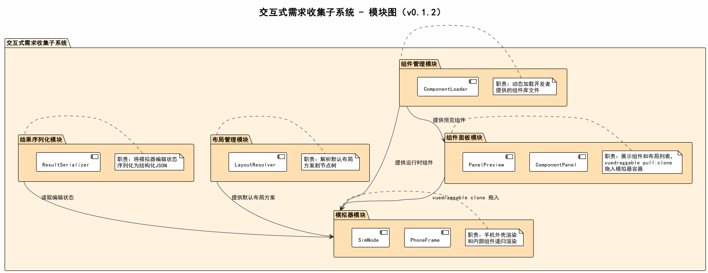
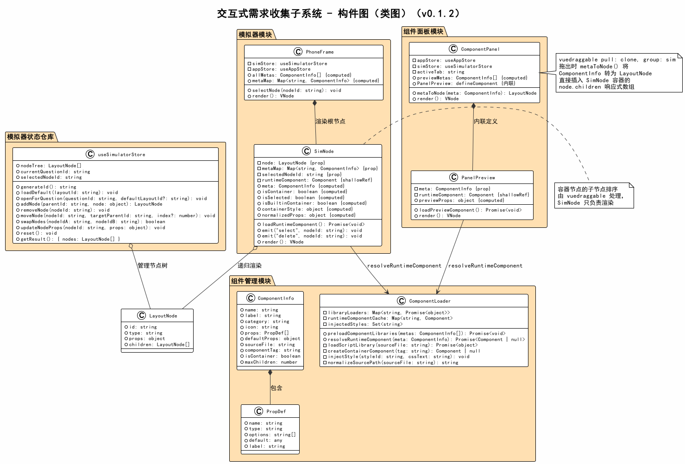

# 详细设计：交互式需求收集子系统

## 1. 概述

交互式需求收集子系统负责手机模拟界面的渲染、组件面板和交互操作。包含5个模块：模拟器模块、组件面板模块、组件管理模块、布局管理模块、结果序列化模块。

> **设计变更记录（v0.1.2）**：
> - 移除原"拖拽控制模块"（DragDropController / DropZoneManager），组件排序和跨容器拖入由 vuedraggable 库承担
> - 从界面子系统移入"组件面板模块"（ComponentPanel），使拖拽数据流在同一子系统内闭环

> **设计变更记录（v0.1.3）**：
> - 组件管理模块从 IIFE + `__rtRegister` 机制改为 vue3-sfc-loader 加载标准 `.vue` SFC 文件
> - Vant 依赖加载和全局样式注入从组件库文件移至 componentLoader.js 内部处理

## 2. 模块图

### 模块职责

| 模块 | 职责 |
|------|------|
| 模拟器模块 | 手机外壳CSS渲染，内部组件递归渲染（SimNode），容器内排序委托给 vuedraggable |
| 组件面板模块 | 展示组件和布局列表，渲染预览，通过 vuedraggable pull:clone 将组件拖入模拟器 |
| 组件管理模块 | 动态加载开发者提供的 `.vue` SFC 文件，通过 vue3-sfc-loader 编译为 Vue 运行时组件 |
| 布局管理模块 | 解析默认布局节点树，提供预设设计方案 |
| 结果序列化模块 | 将模拟器编辑状态序列化为结构化JSON |

### 模块间关系

| 提供方 | 消费方 | 说明 |
|--------|--------|------|
| 组件管理模块 | 模拟器模块 | 提供运行时组件供 SimNode 动态渲染 |
| 组件管理模块 | 组件面板模块 | 提供运行时组件供 PanelPreview 预览渲染 |
| 组件面板模块 | 模拟器模块 | vuedraggable clone 拖入 LayoutNode 到 SimNode 容器 |
| 布局管理模块 | 模拟器模块 | 提供默认设计方案 |
| 结果序列化模块 | 模拟器模块 | 读取节点树并序列化输出 |

### 拖拽排序机制

组件的拖拽排序由 **vuedraggable** 库提供排序和跨容器移动能力，本子系统负责规定拖拽过程中的数据转换规则和放置约束。

**本子系统内的两个模块各持有一个 vuedraggable 实例，共享 `group="sim"`**：

- **组件面板模块**：`pull: 'clone', put: false`（只能拖出，不能拖入）
- **模拟器模块（SimNode 容器）**：默认配置（可接收、可排序）

拖拽数据全程在 Vue 响应式系统内传递，不经过 dataTransfer 字符串序列化。

这种设计的核心原则：**SimNode 是纯渲染组件，不持有任何拖拽事件逻辑；拖拽行为与组件渲染完全解耦。**

## 3. 构件图（类图）

## 4. 类详细说明

### 4.1 模拟器模块

#### PhoneFrame

手机外壳组件，纯CSS实现手机外观。渲染模拟器根节点。

| 属性/方法 | 类型 | 说明 |
|-----------|------|------|
| simStore | useSimulatorStore | 模拟器状态仓库 |
| appStore | useAppStore | 应用状态仓库 |
| allMetas | ComponentInfo[] (computed) | 合并 componentList + layoutList |
| metaMap | Map\<string, ComponentInfo\> (computed) | name → ComponentInfo 的映射 |
| selectNode(nodeId) | void | 选中/取消选中节点（翻转 selectedNodeId） |
| render() | VNode | 渲染手机外壳，内含 SimNode 渲染根节点 |

PhoneFrame 的职责：
1. 渲染手机外壳（状态栏、屏幕区域、Home Indicator）
2. 为根级节点渲染 SimNode 实例（通过 `v-for` 遍历 `simStore.nodeTree`）
3. 为 SimNode 提供 metaMap 和 selectedNodeId
4. 组件库预加载（onMounted / watch allMetas）

PhoneFrame 的根层（`phone-screen`）不使用 vuedraggable，使用普通 div。所有放置目标都是容器 SimNode 内部的 vuedraggable 实例。

PhoneFrame 不监听任何 document 级别事件，不执行 DOM 查询，不持有拖拽状态。

#### SimNode

递归渲染组件，是模拟器的核心渲染单元。只负责渲染，不负责拖拽。

| 属性/方法 | 类型 | 说明 |
|-----------|------|------|
| node | LayoutNode | 当前要渲染的布局节点（prop） |
| metaMap | Map\<string, ComponentInfo\> | 类型名到组件元数据的映射（prop） |
| selectedNodeId | string | 当前选中的节点ID（prop） |
| runtimeComponent | Component (shallowRef) | 已解析的 Vue 运行时组件 |
| meta | ComponentInfo (computed) | 根据 node.type 从 metaMap 查找的元数据 |
| isContainer | boolean (computed) | 是否为容器节点（有 children 数组） |
| isSelected | boolean (computed) | 当前节点是否被选中 |
| isBuiltinContainer | boolean (computed) | 是否为内置容器（VStack/HStack/Grid2Col） |
| containerStyle | object (computed) | 内置容器的 CSS 样式 |
| normalizedProps | object (computed) | 经过类型转换后的属性值 |
| loadRuntimeComponent() | async → void | 根据 meta 加载运行时组件到 shallowRef |
| render() | VNode | 递归渲染节点 |
| emit('select', nodeId) | - | 节点被点击时触发选中 |
| emit('delete', nodeId) | - | 节点删除按钮被点击时触发 |

**渲染逻辑**：

| 情况 | 渲染方式 |
|------|---------|
| 内置容器节点（VStack/HStack/Grid2Col） | vuedraggable 直接作为布局容器，应用 containerStyle |
| 自定义容器节点（有 runtimeComponent + isContainer） | `<component>` 包裹 vuedraggable（group="sim"），vuedraggable 放在 default slot 内 |
| 非容器节点（有 runtimeComponent） | `<component :is="runtimeComponent" v-bind="normalizedProps" />` |
| 回退（无 runtimeComponent，有 children） | 灰盒占位 + vuedraggable |
| 回退（无 runtimeComponent，无 children） | 灰盒占位，显示类型名和 props JSON |

**属性规范化逻辑（normalizedProps）**：

| 属性条件 | 转换规则 |
|---------|---------|
| 属性名为 `items` | 逗号分割字符串 → 数组 |
| PropDef.type === 'number' | `Number()` 转换 |
| PropDef.type === 'boolean' 或已知布尔键（bold/block/isLink等） | `value === true \|\| value === 'true'` |
| 其他 | 原值保留 |

### 4.2 组件面板模块

#### ComponentPanel

组件面板容器，纯 CSS 定位面板（`position: fixed`），不使用 el-drawer，无 overlay。显隐由界面子系统 AppHeader 通过共享状态仓库（`appStore.panelOpen`）控制。

包含组件和布局两个标签页，每个标签页内使用一个 vuedraggable 实例：

- `group: { name: 'sim', pull: 'clone', put: false }` — 只能拖出，不能拖入
- `clone` 回调（`metaToNode`）：将 ComponentInfo 转换为 LayoutNode

| 属性/方法 | 类型 | 说明 |
|-----------|------|------|
| appStore | useAppStore | 应用状态仓库（读取 panelOpen、componentList、layoutList） |
| simStore | useSimulatorStore | 模拟器状态仓库（使用 generateId） |
| activeTab | ref\<string\> | 当前标签页（component/layout），默认 component |
| previewMetas | ComponentInfo[] (computed) | 合并 componentList + layoutList |
| metaToNode(meta) | LayoutNode | clone 回调：ComponentInfo → LayoutNode |
| PanelPreview | defineComponent | 内联定义的预览子组件 |
| render() | VNode | 渲染组件面板 |

**metaToNode 转换规则**：

| 输出字段 | 来源 | 说明 |
|---------|------|------|
| LayoutNode.id | `generateId()` | 全局唯一 ID（格式 `node_{计数}_{时间戳}`） |
| LayoutNode.type | `ComponentInfo.name` | 组件类型标识 |
| LayoutNode.props | `{ ...ComponentInfo.defaultProps }` | 浅拷贝默认属性 |
| LayoutNode.children | `ComponentInfo.isContainer ? [] : undefined` | 容器初始化空数组 |

#### PanelPreview

组件预览卡片，在面板中渲染组件的预览效果。不参与拖拽逻辑（拖拽由外层 vuedraggable 处理）。内联定义在 ComponentPanel.vue 中，非独立文件。

| 属性/方法 | 类型 | 说明 |
|-----------|------|------|
| meta | ComponentInfo | 组件元数据（prop，required） |
| runtimeComponent | Component (shallowRef) | 已解析的运行时组件 |
| previewProps | object (computed) | 预览用属性值（defaultProps 转换后，items 字符串转数组） |
| loadPreviewComponent() | async → void | 异步加载预览组件（watch meta 变化自动调用） |
| render() | VNode | 渲染预览（容器组件显示 Slot A / Slot B 占位） |

### 4.3 组件管理模块

#### ComponentLoader

组件库加载器，通过 vue3-sfc-loader 将开发者提供的 `.vue` SFC 文件编译为 Vue 运行时组件。

| 属性/方法 | 类型 | 说明 |
|-----------|------|------|
| runtimeComponentCache | Map | 已编译的运行时组件缓存（sourcePath → Component） |
| preloadComponentLibraries(metas) | async → void | 预加载所有 sourceFile 指定的 `.vue` 文件（并行编译） |
| resolveRuntimeComponent(meta) | async → Component \| null | 根据元数据解析为 Vue 运行时组件 |
| createContainerComponent(tag) | Component \| null | 创建内置容器组件（VStack/HStack/Grid2Col） |
| normalizeSourcePath(sourceFile) | string | 将相对路径转为 `/static/` 前缀的绝对路径 |
| ensureVantLoaded() | async → void | 确保 Vant CSS/JS 已加载到 window.vant |
| injectGlobalStyles() | void | 注入 Vant 主题变量和全局样式覆写（仅一次） |
| createSfcLoaderOptions() | object | 创建 vue3-sfc-loader 配置（模块缓存映射 vue/vant） |

**组件解析优先级**：

1. 内置容器（VStack/HStack/Grid2Col）→ createContainerComponent 直接创建
2. `.vue` 文件组件 → 从 runtimeComponentCache 取 preload 阶段已编译的组件
3. 降级加载 → 如果缓存未命中，调用 preloadComponentLibraries 单独加载
4. 找不到 → 返回 null，SimNode 使用回退渲染

**加载流程**：

1. `preloadComponentLibraries` 确保 Vant 依赖和全局样式就绪
2. 提取去重的 sourceFile 路径，通过 `fetch` 获取 `.vue` 文件内容
3. vue3-sfc-loader 编译 `.vue` 文件，其中 `import { Button } from 'vant'` 直接从模块缓存解析到 `window.vant`
4. 编译结果以 sourcePath 为 key 存入 runtimeComponentCache

#### ComponentInfo

组件描述信息数据类，同时承载组件和布局的描述。

| 属性 | 类型 | 说明 |
|------|------|------|
| name | string | 组件唯一标识名 |
| label | string | 显示名称 |
| category | string | 分类（导航组件/基础组件/组合组件/布局/测试组件） |
| icon | string | 图标标识 |
| props | PropDef[] | 属性定义列表 |
| defaultProps | object | 默认属性值 |
| sourceFile | string | 库文件路径 |
| componentTag | string | 注册标签名 |
| isContainer | boolean | 是否为容器布局 |
| maxChildren | number | 最大子组件数量，-1 为不限制 |

#### PropDef

属性定义数据类。

| 属性 | 类型 | 说明 |
|------|------|------|
| name | string | 属性名 |
| type | string | 类型（string/number/boolean/enum） |
| options | string[] | 枚举值（type=enum 时） |
| default | any | 默认值 |
| label | string | 显示名称 |

### 4.4 模拟器状态仓库（simulator store）

布局管理模块和结果序列化模块的实际实现已合并到 Pinia store（`simulator.js`）中。

#### useSimulatorStore

模拟器状态仓库，管理节点树、选中状态和所有节点操作。

| 属性/方法 | 类型 | 说明 |
|-----------|------|------|
| nodeTree | ref\<LayoutNode[]\> | 当前节点树 |
| currentQuestionId | ref\<string\> | 当前关联的问题ID |
| selectedNodeId | ref\<string\> | 选中的节点ID |
| generateId() | string | 生成唯一节点ID（格式 `node_{计数}_{时间戳}`） |
| loadDefault(layoutId) | void | 从 appStore.defaultLayouts 加载指定布局方案 |
| openForQuestion(questionId, defaultLayoutId?) | void | 打开模拟器关联指定问题，可选加载默认布局 |
| addNode(parentId, node) | LayoutNode | 添加节点到指定父容器（或根级） |
| removeNode(nodeId) | void | 从树中删除节点 |
| moveNode(nodeId, targetParentId, index?) | void | 移动节点到目标父容器的指定位置 |
| swapNodes(nodeIdA, nodeIdB) | boolean | 交换两个节点的位置 |
| updateNodeProps(nodeId, props) | void | 更新节点属性（合并） |
| reset() | void | 重置模拟器为初始状态 |
| getResult() | { nodes: LayoutNode[] } | 深拷贝当前节点树作为序列化结果 |

辅助函数（内部）：findNode、removeFromTree、extractFromTree、findParentAndIndex、isDescendant、containsNode、deepClone

### 4.5 通用数据类

#### LayoutNode

布局节点，构成模拟器中的组件树。

| 属性 | 类型 | 说明 |
|------|------|------|
| id | string | 节点唯一 ID |
| type | string | 组件/布局类型名（对应 ComponentInfo.name） |
| props | object | 当前属性值 |
| children | LayoutNode[] | 子节点列表（容器布局才有） |

## 5. 模块对外接口

本子系统对外暴露 `I_Simulator`、`I_ComponentRegistry`、`I_LayoutRegistry` 三个接口（见子系统接口文档），各模块与接口的映射关系：

| 对外接口 | 实现模块 | 实现位置 |
|----------|----------|---------|
| I_Simulator | 模拟器模块 + 模拟器状态仓库 | PhoneFrame + SimNode + simulator store（loadDefault/openForQuestion/reset/getResult） |
| I_ComponentRegistry | 组件管理模块 + 应用状态仓库 | componentLoader.js（preloadComponentLibraries/resolveRuntimeComponent）+ app store（componentList） |
| I_LayoutRegistry | 模拟器状态仓库 + 应用状态仓库 | simulator store（loadDefault）+ app store（defaultLayouts/layoutList） |

## 6. 实现文件映射

| 模块 | 实现文件 |
|------|----------|
| 模拟器模块 | src/modules/interactive/components/PhoneFrame.vue |
| | src/modules/interactive/components/SimNode.vue |
| 组件面板模块 | src/modules/interactive/components/ComponentPanel.vue（含内联 PanelPreview） |
| 组件管理模块 | src/modules/interactive/services/componentLoader.js |
| 布局管理 + 结果序列化 + 节点操作 | src/stores/simulator.js |
| 数据类 | src/stores/simulator.js（LayoutNode 结构） |

> **注意**：LayoutResolver 和 ResultSerializer 在代码中未实现为独立类，其职责已合并到 simulator store 中。
