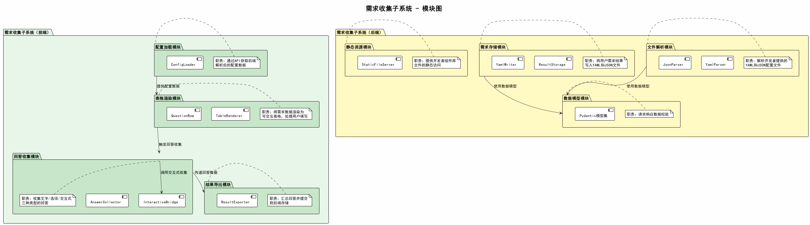
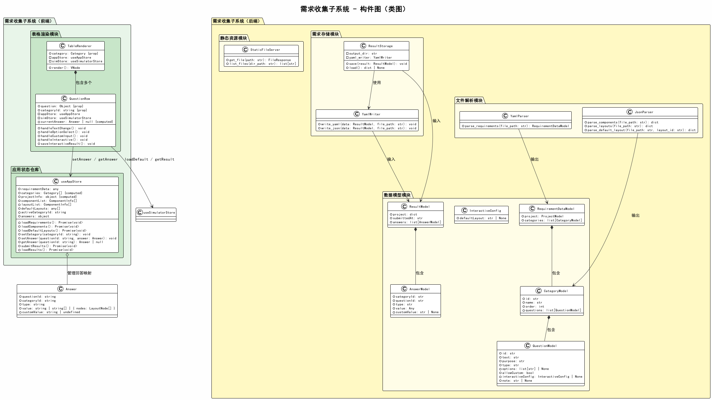

# 详细设计：需求收集子系统

## 1. 概述

需求收集子系统分为前端部分和后端部分。前端负责配置加载、表格渲染、回答收集和结果导出；后端负责文件解析、需求存储、静态资源服务和数据模型校验。

## 2. 模块图

### 前端模块

| 模块 | 职责 |
|------|------|
| 配置加载模块 | 通过API获取后端解析后的配置数据（合并到 appStore） |
| 表格渲染模块 | 将需求数据渲染为可交互表格，处理文字输入、选项选择、交互式触发 |
| 回答收集模块 | 收集三种类型的回答（text/option/interactive），桥接交互式子系统（合并到 appStore + QuestionRow） |
| 结果导出模块 | 汇总回答并提交到后端存储（合并到 appStore） |

### 后端模块

| 模块 | 职责 |
|------|------|
| 文件解析模块 | 解析开发者提供的YAML配置和JSON组件/布局文件 |
| 需求存储模块 | 将用户需求结果写入YAML和JSON文件 |
| 静态资源模块 | 提供开发者组件库文件的静态访问 |
| 数据模型模块 | Pydantic数据模型，用于请求响应校验 |

## 3. 构件图（类图）

## 4. 前端类详细说明

> **注意**：前端部分 ConfigLoader、AnswerCollector、InteractiveBridge、ResultExporter 未实现为独立类文件，其职责合并到 appStore（配置加载、回答收集、结果导出）和 QuestionRow（交互式桥接）中。

### 4.1 配置加载模块（appStore 部分）

配置加载功能由 `appStore`（src/stores/app.js）承担，无独立类。

| 方法 | 类型 | 说明 |
|------|------|------|
| loadRequirements() | async → void | 调用 api.getRequirements() 获取需求数据，自动设置首个分类为激活 |
| loadComponents() | async → void | 调用 api.getComponents() 获取组件描述，按 isContainer 分为 componentList 和 layoutList |
| loadDefaultLayouts() | async → void | 调用 api.getDefaultLayout() 获取默认布局方案 |
| loadResults() | async → void | 调用 api.getResults() 获取已保存结果，回写到 answers |

无缓存机制，每次调用直接请求 API。

### 4.2 表格渲染模块

#### TableRenderer

需求表格渲染组件，渲染当前分类的表格。

| 属性/方法 | 类型 | 说明 |
|-----------|------|------|
| category | Category (prop) | 当前分类对象（由 ContentArea 传入） |
| appStore | useAppStore | 应用状态仓库 |
| simStore | useSimulatorStore | 模拟器状态仓库 |
| render() | VNode | 渲染分类标题 + 表格（遍历 category.questions 渲染 QuestionRow） |

#### QuestionRow

单行问题渲染组件，处理三种类型的回答交互，并内联了交互式桥接逻辑。

| 属性/方法 | 类型 | 说明 |
|-----------|------|------|
| question | Object (prop) | 当前问题数据 |
| categoryId | string (prop) | 所属分类ID |
| appStore | useAppStore | 应用状态仓库 |
| simStore | useSimulatorStore | 模拟器状态仓库 |
| currentAnswer | Answer \| null (computed) | 当前问题的已有回答（从 appStore.getAnswer 获取） |
| textValue | ref\<string\> | 文字输入值 |
| selectedOptions | ref\<string[]\> | 已选选项 |
| customInput | ref\<string\> | 自定义输入值 |
| handleTextChange() | void | 文字输入回调，调用 appStore.setAnswer |
| handleOptionSelect() | void | 选项选择回调，调用 appStore.setAnswer |
| handleCustomInput() | void | 自定义输入回调，调用 appStore.setAnswer |
| handleInteractive() | void | 打开模拟器：加载已有结果或默认布局，设置 currentQuestionId，显示模拟器 |
| saveInteractiveResult() | void | 保存模拟器结果：调用 simStore.getResult()，写入 appStore.setAnswer |

### 4.3 回答收集模块（appStore 部分）

回答收集功能由 `appStore` 承担，无独立类。

| 属性/方法 | 类型 | 说明 |
|-----------|------|------|
| answers | ref\<object\> | 回答映射（questionId → Answer） |
| setAnswer(questionId, answer) | void | 收集一条回答 |
| getAnswer(questionId) | Answer \| null | 获取指定问题的回答 |

### 4.4 结果导出模块（appStore 部分）

结果导出功能由 `appStore` 承担，无独立类。

| 方法 | 类型 | 说明 |
|------|------|------|
| submitResults() | async → void | 汇总 answers，构造 { project, submittedAt, answers } 提交到后端 |

### 4.5 前端数据类

#### Answer

| 属性 | 类型 | 说明 |
|------|------|------|
| questionId | string | 问题ID |
| categoryId | string | 分类ID |
| type | string | 回答类型（text/option/interactive） |
| value | string \| string[] \| { nodes: LayoutNode[] } | 回答内容（interactive 类型为 { nodes: LayoutNode[] }） |
| customValue | string \| undefined | 自定义输入值（allowCustom 且选中"自定义"时） |

## 5. 后端类详细说明

### 5.1 数据模型模块

#### RequirementDataModel

需求配置的Pydantic顶层模型。

| 属性 | 类型 | 说明 |
|------|------|------|
| project | ProjectModel | 项目信息 |
| categories | list[CategoryModel] | 需求分类列表 |

#### CategoryModel

| 属性 | 类型 | 说明 |
|------|------|------|
| id | str | 分类ID |
| name | str | 分类名称 |
| order | int | 排序序号 |
| questions | list[QuestionModel] | 问题列表 |

#### QuestionModel

| 属性 | 类型 | 说明 |
|------|------|------|
| id | str | 问题ID |
| text | str | 问题内容 |
| purpose | str | 问题目的 |
| type | str | 回答类型 |
| options | list[str] \| None | 选项列表 |
| allowCustom | bool | 是否允许自定义输入 |
| interactiveConfig | InteractiveConfig \| None | 交互式配置 |
| note | str \| None | 备注 |

#### InteractiveConfig

| 属性 | 类型 | 说明 |
|------|------|------|
| defaultLayout | str \| None | 默认布局方案ID |

#### AnswerModel

| 属性 | 类型 | 说明 |
|------|------|------|
| categoryId | str | 分类ID |
| questionId | str | 问题ID |
| type | str | 回答类型 |
| value | Any | 回答内容 |
| customValue | str \| None | 自定义值 |

#### ResultModel

| 属性 | 类型 | 说明 |
|------|------|------|
| project | dict | 项目信息 |
| submittedAt | str | 提交时间 |
| answers | list[AnswerModel] | 回答列表 |

### 5.2 文件解析模块

#### YamlParser

| 属性/方法 | 类型 | 说明 |
|-----------|------|------|
| parse_requirements(file_path) | RequirementDataModel | 解析YAML需求配置文件，返回校验后的数据模型 |

#### JsonParser

| 属性/方法 | 类型 | 说明 |
|-----------|------|------|
| parse_components(file_path) | dict | 解析组件描述JSON文件 |
| parse_layouts(file_path) | dict | 解析布局定义JSON文件 |
| parse_default_layout(file_path, layout_id) | dict | 解析默认设计方案中指定ID的布局 |

### 5.3 需求存储模块

#### ResultStorage

| 属性/方法 | 类型 | 说明 |
|-----------|------|------|
| output_dir | str | 输出目录（构造时传入） |
| yaml_writer | YamlWriter | YAML/JSON 写入器 |
| save(result) | void | 将结果同时写入 YAML 和 JSON 文件（设置 submittedAt 时间戳） |
| load() | dict \| None | 从 JSON 文件加载已保存的结果 |

#### YamlWriter

| 属性/方法 | 类型 | 说明 |
|-----------|------|------|
| write_yaml(data, file_path) | void | 写入YAML格式文件（人类可读） |
| write_json(data, file_path) | void | 写入JSON格式文件（结构化） |

### 5.4 静态资源模块

#### StaticFileServer

| 属性/方法 | 类型 | 说明 |
|-----------|------|------|
| get_file(path) | FileResponse | 返回指定路径的静态文件 |
| list_files(dir_path) | list[str] | 列出目录下的文件列表 |

## 6. 模块对外接口

本子系统对外暴露的HTTP接口（见子系统接口文档）：

| 对外接口 | 实现模块 | 说明 |
|----------|----------|------|
| I_ParseService (GET /api/requirements) | 文件解析模块 | YamlParser.parse_requirements |
| I_ParseService (GET /api/components) | 文件解析模块 | JsonParser.parse_components |
| I_ParseService (GET /api/default-layout) | 文件解析模块 | JsonParser.parse_default_layout |
| I_StorageService (POST /api/results) | 需求存储模块 | ResultStorage.save |
| I_StorageService (GET /api/results) | 需求存储模块 | ResultStorage.load |
| I_StaticService (GET /static/lib/{path}) | 静态资源模块 | StaticFileServer.get_file |

## 7. 实现文件映射

### 前端

| 模块 | 实现文件 |
|------|----------|
| 表格渲染模块 | src/modules/requirement/components/TableRenderer.vue |
| | src/modules/requirement/components/QuestionRow.vue |
| 配置加载 + 回答收集 + 结果导出 | src/stores/app.js |

### 后端

| 模块 | 实现文件 |
|------|----------|
| 数据模型模块 | backend/models/requirement.py |
| | backend/models/result.py |
| 文件解析模块 | backend/services/parser.py |
| 需求存储模块 | backend/services/storage.py |
| 静态资源模块 | backend/services/static.py |
| API路由 | backend/routers/api.py |
| 静态资源路由 | backend/routers/static_route.py |
