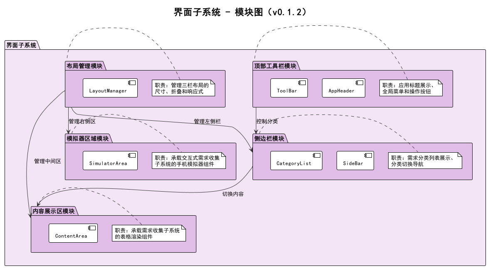
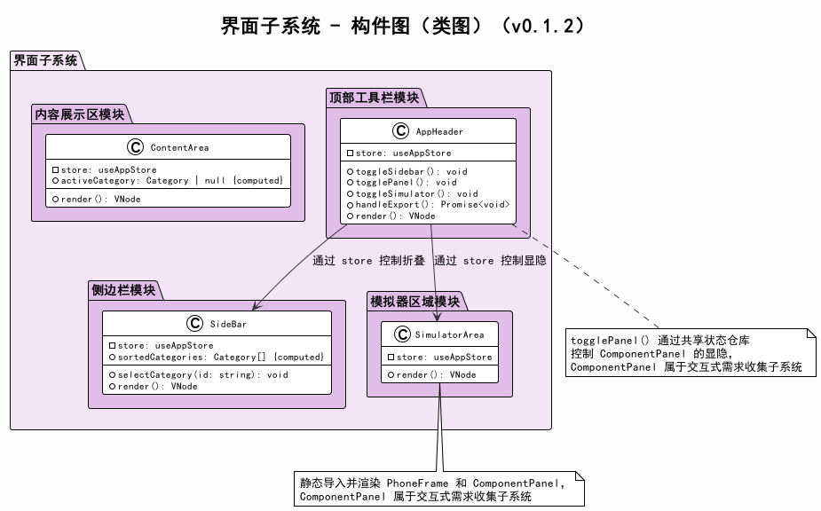

# 详细设计：界面子系统

## 1. 概述

界面子系统负责系统的整体界面框架和布局，包括顶部工具栏、侧边栏、内容展示区和手机模拟器区域。界面子系统为其他两个子系统提供容器和导航支持。

> **设计变更记录（v0.1.2）**：
> - 将原"组件面板模块"从本子系统移至交互式需求收集子系统。组件面板涉及组件预览渲染和 LayoutNode 数据转换，与交互式子系统职责更紧密。AppHeader 通过共享状态仓库（appStore）控制面板显隐，保持导航控制权。
> - 移除独立的 ToolBar、CategoryList、MenuItem、LayoutManager、LayoutConfig 类，其职责已合并到 AppHeader、SideBar 组件和 appStore 中。

## 2. 模块图



### 模块职责

| 模块 | 职责 |
|------|------|
| 顶部工具栏模块 | 应用标题展示、全局操作按钮（侧边栏折叠、面板开关、模拟器显隐、导出） |
| 侧边栏模块 | 需求分类列表展示（按 order 排序），支持分类切换导航 |
| 内容展示区模块 | 承载需求收集子系统的表格渲染组件 |
| 模拟器区域模块 | 承载交互式需求收集子系统的手机模拟器组件和组件面板 |

### 模块间关系

| 提供方 | 消费方 | 说明 |
|--------|--------|------|
| 顶部工具栏模块 | 侧边栏模块 | 通过共享状态仓库控制侧边栏折叠/展开 |
| 顶部工具栏模块 | 交互式子系统·组件面板 | 通过共享状态仓库控制面板显隐 |
| 顶部工具栏模块 | 模拟器区域模块 | 通过共享状态仓库控制模拟器显隐 |
| 侧边栏模块 | 内容展示区模块 | 分类切换触发内容刷新 |

## 3. 构件图（类图）



## 4. 类详细说明

### 4.1 顶部工具栏模块

#### AppHeader

应用顶部栏组件，包含标题和工具栏操作按钮。

| 属性/方法 | 类型 | 说明 |
|-----------|------|------|
| store | useAppStore | 共享状态仓库实例 |
| toggleSidebar() | void | 切换侧边栏折叠/展开（翻转 store.sidebarCollapsed） |
| togglePanel() | void | 切换组件面板显隐（翻转 store.panelOpen，组件面板属于交互式子系统） |
| toggleSimulator() | void | 切换模拟器显隐（翻转 store.simulatorVisible） |
| handleExport() | async → void | 导出需求结果（调用 store.submitResults()） |
| render() | VNode | 渲染标题 + 操作按钮组 |

标题从 `store.projectInfo.name` 动态读取，无独立 title 属性。所有操作按钮直接内联在 AppHeader 中，无独立 ToolBar 子组件。

### 4.2 侧边栏模块

#### SideBar

侧边栏组件，展示分类列表并支持切换导航。

| 属性/方法 | 类型 | 说明 |
|-----------|------|------|
| store | useAppStore | 共享状态仓库实例 |
| sortedCategories | Category[] (computed) | 按 order 排序的分类列表 |
| selectCategory(id) | void | 切换激活分类（调用 store.setCategory(id)） |
| render() | VNode | 渲染分类列表 |

折叠状态（`store.sidebarCollapsed`）和激活分类（`store.activeCategoryId`）直接从共享状态仓库读取，由 AppHeader 的 toggleSidebar() 和本组件的 selectCategory() 分别控制。

### 4.3 内容展示区模块

#### ContentArea

中间内容区域容器，承载需求收集子系统的表格组件。

| 属性/方法 | 类型 | 说明 |
|-----------|------|------|
| store | useAppStore | 共享状态仓库实例 |
| activeCategory | Category \| null (computed) | 当前激活的分类对象 |
| render() | VNode | 渲染内容区域，包含 TableRenderer 子组件 |

activeCategory 根据 store.activeCategoryId 从 store.categories 中查找。当无激活分类时显示提示文字。

### 4.4 模拟器区域模块

#### SimulatorArea

右侧手机模拟器容器，静态承载交互式需求收集子系统的模拟器组件和组件面板。

| 属性/方法 | 类型 | 说明 |
|-----------|------|------|
| store | useAppStore | 共享状态仓库实例 |
| render() | VNode | 渲染 PhoneFrame 和 ComponentPanel |

静态导入 PhoneFrame 和 ComponentPanel 组件，模拟器显隐由 `store.simulatorVisible` 控制 CSS class。ComponentPanel 虽属于交互式需求收集子系统，但在本组件中渲染。

## 5. 界面布局示意

```
+--------------------------------------------------------------+
|  AppHeader（标题 + 操作按钮）                                   |
+----------+---------------------------+-----------------------+
|          |                           |                       |
| SideBar  |     ContentArea           |   SimulatorArea       |
|          |                           |                       |
| 分类列表  |  TableRenderer            |   PhoneFrame          |
| (排序)   |  (需求收集子系统)           |   (交互式需求收集子系统) |
|          |                           |                       |
|          |                           |                       |
+----------+---------------------------+-----------------------+

               [ComponentPanel] (交互式子系统，position: fixed)
               由 AppHeader 通过共享状态仓库控制显隐
               在 SimulatorArea 中渲染
```

## 6. 模块对外接口

本子系统对外暴露 `I_Navigation` 和 `I_Layout` 两个接口：

| 对外接口 | 实现模块 | 实现位置 |
|----------|----------|---------|
| I_Navigation.switchCategory | 侧边栏模块 | SideBar.selectCategory → store.setCategory |
| I_Navigation.togglePanel | 顶部工具栏模块 | AppHeader.togglePanel → store.panelOpen |
| I_Layout.setSimulatorVisible | 模拟器区域模块 | AppHeader.toggleSimulator → store.simulatorVisible |
| I_Layout.setContentData | 内容展示区模块 | ContentArea.activeCategory (computed) |

## 7. 实现文件映射

| 模块 | 实现文件 |
|------|----------|
| 顶部工具栏模块 | src/modules/ui/components/AppHeader.vue |
| 侧边栏模块 | src/modules/ui/components/SideBar.vue |
| 内容展示区模块 | src/modules/ui/components/ContentArea.vue |
| 模拟器区域模块 | src/modules/ui/components/SimulatorArea.vue |
| 共享状态（布局状态） | src/stores/app.js |
